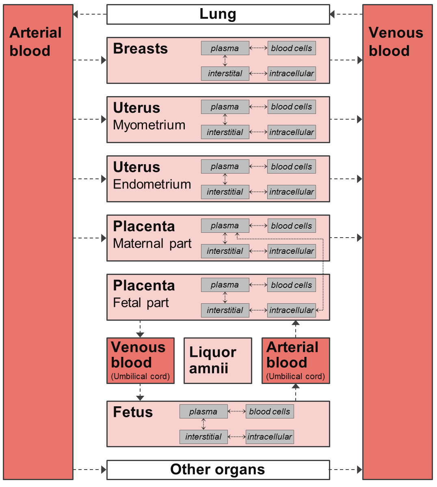

# Physiologically Based Pharmacokinetic Models for Pregnant Women

Within this repository, we distribute the physiologically-based whole-body models for pregnant women published in [[1,2,3,4,5](#references)].

The pregnancy (and postpartum) PBPK model for amoxicillin published in [[6](#references)] can be found [here](https://github.com/Open-Systems-Pharmacology/Amoxicillin-Model).

The pregnancy model structure comprises per default 27 compartments, including nine pregnancy-specific compartments as shown in the schema below.

## Repository files
* The models are provided as ready-to-use MoBi® and PK-Sim® projects (subfolder _Models_)
  * _Cefazolin_, _Cefuroxime_ and _Cefradine_ model evaluation is described in [[2](#references)]
  * _Caffeine_, _Midazolam_, _Nifedipine_, _Metoprolol_, _Ondansetron_, _Granisetron_, _Diazepam_ and _Metronidazole_ model evaluation is described in [[3](#references)]
  * _Acyclovir_ model evaluation is described in [[4](#references)]
  * _Dolutegravir_ model evaluation is described in [[5](#references)]
  
* _BuildingBlocks_ subfolder contains MoBi® building block for spatial structure and passive transports. Those building blocks can be used in MoBi® to build new substance models.

## HowTo
Currently, simulations based on pregnant individuals cannot be built up directly in PK-Sim® (due to the fact that e.g. for the protein model not all required data was collected). 

### How to combine an existing (MoBi®) pregnancy model with a pregnancy population created in PK-Sim®
Steps 3 to 5 are performed in PK-Sim.
1. If a (MoBi®) pregnancy model is available in **pkml** format, go to the step 3
2. If a (MoBi®) pregnancy model is available in **mbp3** format (MoBi® project): open it in MoBi®, select simulation of interest and save it in pkml format
3. Create an Individual using population **Pregnant (Dallmann et al. 2017)**

   _Please note that in PK-Sim®, the fertilization age (FA) is defined via the individual’s age, with 30 years corresponding to a FA of 0 weeks (i.e. just prior to conception). Hence, a pregnant woman with a FA of 38 weeks is defined using an age of 30.75 years._

4. Create a pregnancy population with the required settings based on the individual above
5. Import (MoBi®) pregnancy model in **pkml** format and combine it with created population building block as described in the [OSP Suite manual](https://github.com/Open-Systems-Pharmacology/OSPSuite.Documentation/blob/master/Open%20Systems%20Pharmacology%20Suite.pdf) (**Ch. 21.2 Importing Individual and Population Simulation**)

### How to create a new pregnancy model
The procedure is described in a comprehensive [tutorial](https://doi.org/10.1002/psp4.12300).

## Version information
The physiology is based on the PBPK model implemented in PK-Sim® version 6.0. The MoBi® project files were created in version 6.0.

## Code of conduct
Everyone interacting in the Open Systems Pharmacology community (codebases, issue trackers, chat rooms, mailing lists etc...) is expected to follow the Open Systems Pharmacology [code of conduct](https://github.com/Open-Systems-Pharmacology/Suite/blob/master/CODE_OF_CONDUCT.md#contributor-covenant-code-of-conduct).

## Contribution
We encourage contribution to the Open Systems Pharmacology community. Before getting started please read the [contribution guidelines](https://github.com/Open-Systems-Pharmacology/Suite/blob/master/CONTRIBUTING.md#ways-to-contribute). If you are contributing code, please be familiar with the [coding standard](https://github.com/Open-Systems-Pharmacology/Suite/blob/master/CODING_STANDARDS.md#visual-studio-settings).

## License
The model code is distributed under the [GPLv2 License](https://github.com/Open-Systems-Pharmacology/Suite/blob/develop/LICENSE).

## References
[1] [Dallmann A, Ince I, Meyer M, Willmann S, Eissing T, Hempel G. Gestation-Specific Changes in the Anatomy and Physiology of Healthy Pregnant Women: An Extended Repository of Model Parameters for Physiologically Based Pharmacokinetic Modeling in Pregnancy. *Clin Pharmacokinet.* 56(11), 2017: 1303-1330. doi: 10.1007/s40262-017-0539-z](https://pubmed.ncbi.nlm.nih.gov/28401479/)

[2] [Dallmann A, Ince I, Solodenko J, Meyer M, Willmann S, Eissing T, Hempel G. Physiologically Based Pharmacokinetic Modeling of Renally Cleared Drugs in Pregnant Women. *Clin Pharmacokinet.* 56(12), 2017: 1525-1541. doi: 10.1007/s40262-017-0538-0](https://www.ncbi.nlm.nih.gov/pubmed/28391404/)

[3] [Dallmann A, Ince I, Coboeken K, Eissing T, Hempel G. A Physiologically Based Pharmacokinetic Model for Pregnant Women to Predict the Pharmacokinetics of Drugs Metabolized Via Several Enzymatic Pathways. *Clin Pharmacokinet.* 57(6), 2018: 749-768. doi: 10.1007/s40262-017-0594-5](https://www.ncbi.nlm.nih.gov/pubmed/28924743/)

[4] [Xiaomei LI, Momper JD, Rakhmanina N, van den Anker JN, Green DJ, Burckart GJ, Best BM, Mirochnick M, Capparelli EV, Dallmann A. Physiologically based pharmacokinetic models to predict maternal pharmacokinetics and fetal exposure to emtricitabine and acyclovir. *J Clin Pharmacol.* 60(2), 2020: 240-255. doi: 10.1002/jcph.1515](https://pubmed.ncbi.nlm.nih.gov/31489678/)

[5] [Xiaomei LI, Momper JD, Rakhmanina NY, Green DJ, Burckart GJ, Cressey TR, Mirochnick M, Best BM, van den Anker JN, Dallmann A. Prediction of Maternal and Fetal Pharmacokinetics of Dolutegravir and Raltegravir Using Physiologically Based Pharmacokinetic Modeling. *Clin Pharmacokinet.* 2020 [ePub ahead of print]. doi: 10.1007/s40262-020-00897-9](https://pubmed.ncbi.nlm.nih.gov/32451908/)

[6] [Dallmann A, Himstedt A, Solodenko J, Ince I, Hempel G, Eissing T. Integration of physiological changes during the postpartum period into a PBPK framework and prediction of amoxicillin disposition before and shortly after delivery. *J Pharmacokinet Pharmacodyn.* 47(4), 2020: 341-359. doi: 10.1007/s10928-020-09706-z](https://pubmed.ncbi.nlm.nih.gov/32748112/)
