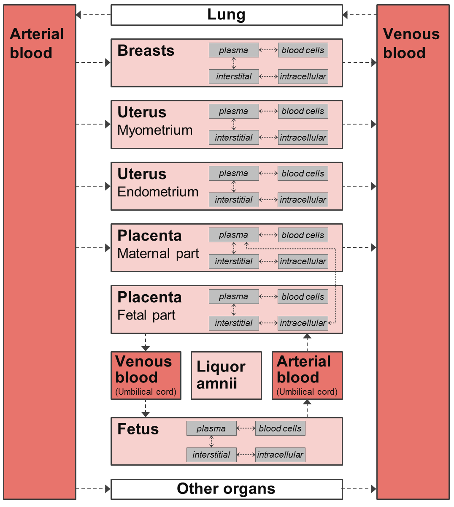

# Physiologically Based Pharmacokinetic Models for Pregnancy

Within this repository, we distribute MoBi modules of maternal-fetal physiology for the whole-body physiologically-based (PB) models to simulate pharmacokinetics (PK) of compounds in pregnant individuals. The modules are based on the PBPK pregnancy models published in [[1,2,3,4,5,6,7](#references)]. Additionally, this repository contains the refined passive transports building block which was used to build pregnancy PBPK models with different unbound drug fractions in maternal and fetal organism as described in [[8](#references)].

The pregnancy model structure comprises per default 27 compartments, including nine pregnancy-specific compartments as shown in the schema below.

## Repository files

## PBPK model snapshots

PK-Sim snapshots and MoBi modeuls used for the validation of the modules.

- **Aciclovir-Model**: Aciclovir model based on the model used in the [9.1 release](https://github.com/Open-Systems-Pharmacology/Pregnancy-Models/releases/tag/v1.0).

### Pregnancy PBPK extension modules

This repository provides the implementation of published pregnancy PBPK model structure published in [[1,2,3,4,5,6,7](#references)]. The origingal simulations described in the publichations were developed with version 9.1 of the OSP Software and are provided in the [9.1 release](https://github.com/Open-Systems-Pharmacology/Pregnancy-Models/releases/tag/v1.0) as ready-to-use MoBi® and PK-Sim® projects (subfolder _Models_).

The extension modules are provided in the subfolder *Modules*. The following extension modules are available:

* **Maternal Structure (incl. fetal placenta and placental transfer)**: SHORT DESCRIPTION with reference to the source where the model was described first
* **Simple Fetal Structure (Dallmann)**: SHORT DESCRIPTION with reference to the source where the model was described first
* **Complex Fetal structure**: SHORT DESCRIPTION with reference to the source where the model was described first

### Model evaluation reports

The subfolder _Validation reports_ contains evaluation reports and the [{esqlabsR}](https://esqlabs.github.io/esqlabsR/) project to generate the reports.

Currently, the modules have been evaluated with the aciclovir example published in [[4](#references)].

## How to run pregnancy PBPK simulations
Currently, simulations based on pregnant individuals cannot be built up directly in PK-Sim® (due to the fact that e.g. for the protein model structure not all required data was collected). 

### How to combine an existing (MoBi®) pregnancy model with a pregnancy population created in PK-Sim®

This section describes the workflow for combination of a PBPK model developed in PK-Sim with the pregnancy module on the example of the Acyclovir model.

#### In PK-Sim®:

1. Create a simulation using the Administration Protocol that should be simulated with the pregnancy model. The used Individual must not necessarily be from a Pregnancy Population.
   1. In the example, the simulation `po 400mg 3xdaily 3 weeks` from the snapshot `Models/Acyclovir-Model.json` is used.
2. Send the simulation to MoBi.

#### In (MoBi®):

The pregnancy extension requires two extension modules:

* Maternal module, including maternal organs, the maternal and fetal sides of the placenta, and passive transport for placental transfer
* Fetal module including umbilical cord, fetal blood, and fetal compartment. This repository provides two versions of a fetal module.

4. Right-click on ‘Modules’ and then navigate to ‘Load Module...’ and select `Maternal Structure (incl. fetal placenta and placental transfer).pkml`.
5. Right-click on ‘Modules’ and then navigate to ‘Load Module...’ and select `Simple Fetal Structure (Dallmann).pkml`.
6. **Add Initial Conditions to the Maternal Module**. Right-click on the maternal extension module, select ‘Add Building Blocks..', and select "Initial Conditions". Click "OK".
7. Open the created 'Initial Conditions' and click on the 'Extend' symbol in the upper left corner.
8. Select the molecules that should be present in the maternal physiology structure. In the example, select "Aciclovir" only. If you also want to express proteins in the new organs, select the respective proteins.
9. Repeat steps 6-8 for the fetal module.
10. **Create a pregnant individual**. Create an individual using the population `Pregnant (Dallmann et al. 2017)` and set the age to 30.72 years.

   _Please note that in PK-Sim®, the fertilization age (FA) is defined via the individual’s age, with 30 years corresponding to a FA of 0 weeks (i.e. just prior to conception). Hence, a pregnant woman with a FA of 38 weeks is defined using an age of 30.72 years._

11. **Create a pregnant simulation.** Add the modules in the following order:
11.1 Non-Pregnant module (imported from PK-Sim)
11.2 Maternal Structure
11.3 Fetal Structure
12. Select the pregnant individual

## Version information
The physiology is based on the PBPK model implemented in PK-Sim® version 12.0. The MoBi® project files were created in version 12.0.

## Code of conduct
Everyone interacting in the Open Systems Pharmacology community (codebases, issue trackers, chat rooms, mailing lists etc...) is expected to follow the Open Systems Pharmacology [code of conduct](https://github.com/Open-Systems-Pharmacology/Suite/blob/master/CODE_OF_CONDUCT.md#contributor-covenant-code-of-conduct).

## Contribution
We encourage contribution to the Open Systems Pharmacology community. Before getting started please read the [contribution guidelines](https://github.com/Open-Systems-Pharmacology/Suite/blob/master/CONTRIBUTING.md#ways-to-contribute). If you are contributing code, please be familiar with the [coding standard](https://github.com/Open-Systems-Pharmacology/Suite/blob/master/CODING_STANDARDS.md#visual-studio-settings).

## License
The model code is distributed under the [GPLv2 License](https://github.com/Open-Systems-Pharmacology/Suite/blob/develop/LICENSE).

## References
[1] [Dallmann A, Ince I, Meyer M, Willmann S, Eissing T, Hempel G. Gestation-Specific Changes in the Anatomy and Physiology of Healthy Pregnant Women: An Extended Repository of Model Parameters for Physiologically Based Pharmacokinetic Modeling in Pregnancy. *Clin Pharmacokinet.* 56(11), 2017: 1303-1330. doi: 10.1007/s40262-017-0539-z](https://pubmed.ncbi.nlm.nih.gov/28401479/)

[2] [Dallmann A, Ince I, Solodenko J, Meyer M, Willmann S, Eissing T, Hempel G. Physiologically Based Pharmacokinetic Modeling of Renally Cleared Drugs in Pregnant Women. *Clin Pharmacokinet.* 56(12), 2017: 1525-1541. doi: 10.1007/s40262-017-0538-0](https://www.ncbi.nlm.nih.gov/pubmed/28391404/)

[3] [Dallmann A, Ince I, Coboeken K, Eissing T, Hempel G. A Physiologically Based Pharmacokinetic Model for Pregnant Women to Predict the Pharmacokinetics of Drugs Metabolized Via Several Enzymatic Pathways. *Clin Pharmacokinet.* 57(6), 2018: 749-768. doi: 10.1007/s40262-017-0594-5](https://www.ncbi.nlm.nih.gov/pubmed/28924743/)

[4] [Liu XI, Momper JD, Rakhmanina N, van den Anker JN, Green DJ, Burckart GJ, Best BM, Mirochnick M, Capparelli EV, Dallmann A. Physiologically based pharmacokinetic models to predict maternal pharmacokinetics and fetal exposure to emtricitabine and acyclovir. *J Clin Pharmacol.* 60(2), 2020: 240-255. doi: 10.1002/jcph.1515](https://pubmed.ncbi.nlm.nih.gov/31489678/)

[5] [Liu XI, Momper JD, Rakhmanina NY, Green DJ, Burckart GJ, Cressey TR, Mirochnick M, Best BM, van den Anker JN, Dallmann A. Prediction of Maternal and Fetal Pharmacokinetics of Dolutegravir and Raltegravir Using Physiologically Based Pharmacokinetic Modeling. *Clin Pharmacokinet.* 59(11), 2020: 1433-1450. doi: 10.1007/s40262-020-00897-9](https://pubmed.ncbi.nlm.nih.gov/32451908/)

[6] [Mian P, van den Anker JN, van Calsteren K, Annaert P, Tibboel D, Pfister M, Allegaert K, Dallmann A. Physiologically Based Pharmacokinetic Modeling to Characterize Acetaminophen Pharmacokinetics and N-Acetyl-p-Benzoquinone Imine (NAPQI) Formation in Non-Pregnant and Pregnant Women. *Clin Pharmacokinet.* 59(1), 2020: 97-110. doi: 10.1007/s40262-019-00799-5](https://pubmed.ncbi.nlm.nih.gov/31347013/)

[7] [Mian P, Allegaert K, Conings S, Annaert P, Tibboel D, Pfister M, van Calsteren K, van den Anker JN, Dallmann A. Integration of Placental Transfer in a Fetal–Maternal Physiologically Based Pharmacokinetic Model to Characterize Acetaminophen Exposure and Metabolic Clearance in the Fetus. *Clin Pharmacokinet.* 59(7), 2020: 911-925. doi: 10.1007/s40262-020-00861-7](https://pubmed.ncbi.nlm.nih.gov/32052378/)

[8] [Liu XI, Green DJ, van den Anker JN, Rakhmanina NY, Ahmadzia HK, Momper J, Park K, Burckart G, Dallmann A. Mechanistic Modeling of Placental Drug Transfer in Humans: How Do Differences in Maternal/Fetal Fraction of Unbound Drug and Placental Influx/Efflux Transfer Rates Affect Fetal Pharmacokinetics? *Front Pediatr.* 9, 2021: 723006. doi: 10.3389/fped.2021.723006](https://www.frontiersin.org/articles/10.3389/fped.2021.723006)