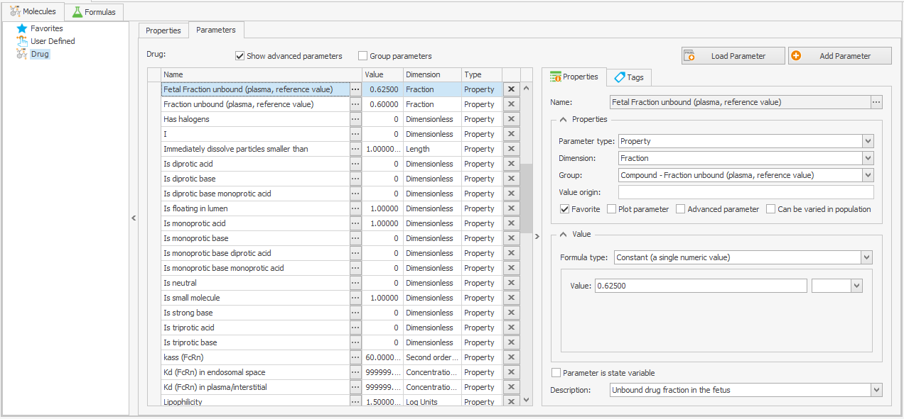

# Physiologically Based Pharmacokinetic Models for Pregnant Women

Within this repository, we distribute the physiologically-based whole-body models for pregnant individuals published in [[1,2,3,4,5,6,7](#references)]. Additionally, this repository contains the refined passive transports building block which was used to build pregnancy PBPK models with different unbound drug fractions in maternal and fetal organism as described in [[8](#references)] as well as the *in silico* cotyledon perfusion model presented in [[9](#references)].

The pregnancy (and postpartum) PBPK model for amoxicillin published in [[10](#references)] can be found [here](https://github.com/Open-Systems-Pharmacology/Amoxicillin-Model).

The pregnancy model structure comprises per default 27 compartments, including nine pregnancy-specific compartments as shown in the schema below.

## Repository files
### Whole-body PBPK models

The pregnancy PBPK models published in [[1,2,3,4,5,6,7](#references)] are provided as ready-to-use MoBi® and PK-Sim® projects (subfolder _Models_). Evaluation of these model is described in the following publications:
  * _Cefazolin_, _cefuroxime_ and _cefradine_ model evaluation is described in [[2](#references)]
  * _Caffeine_, _midazolam_, _nifedipine_, _metoprolol_, _ondansetron_, _granisetron_, _diazepam_ and _metronidazole_ model evaluation is described in [[3](#references)]
  * _Acyclovir_ and _emtricitabine_ model evaluation is described in [[4](#references)]
  * _Dolutegravir_ and _raltegravir_ model evaluation is described in [[5](#references)]
  * _Acetaminophen_ model evaluation is described in [[6,7,9](#references)]

The subfolder *BuildingBlocks* contains the MoBi® building blocks for spatial structure and passive transports in pregnant individuals. Those building blocks can be used in MoBi® to build new substance models (see below). 

Note that the building block `PassiveTransport_PregnantWoman.pkml` includes the drug's fraction unbound as global parameter for both the maternal and fetal organism, i.e. differential protein binding in mother and fetus cannot be modeled with this building block.

### Accounting for different unbound drug fractions in maternal and fetal compartments

The `pkml` file `PassiveTransport_PregnantWoman_with-fetal-fu.pkml` (subfolder *BuildingBlocks*) is a refined building block where the drug's fraction unbound was separately implemented in the maternal and fetal organism as described in [[8](#references)]. 

When setting up a pregnancy PBPK model using this building block, the fetal fraction unbound needs to be added as new parameter called `Fetal Fraction unbound (plasma, reference value)` to the drug's parameter list in the `Molecule building block` as shown below:

### in silico cotyledon perfusion model

The *in silico* cotyledon perfusion model presented in [[9](#references)] is provided as MoBi® file (subfolder _CotyledonPerfusionModel_). Note that this model was built with MoBi® version 9.1 and is not updated with new releases of MoBi®.

## How to run pregnancy PBPK simulations
Currently, simulations based on pregnant individuals cannot be built up directly in PK-Sim® (due to the fact that e.g. for the protein model structure not all required data was collected). 

### How to combine an existing (MoBi®) pregnancy model with a pregnancy population created in PK-Sim®
Steps 3 to 5 are performed in PK-Sim®.
1. If a (MoBi®) pregnancy model is available in `pkml` format, go to the step 3
2. If a (MoBi®) pregnancy model is available in `mbp3` format (MoBi® project): open it in MoBi®, select simulation of interest and save it in `pkml` format
3. Create an individual using the population `Pregnant (Dallmann et al. 2017)`

   _Please note that in PK-Sim®, the fertilization age (FA) is defined via the individual’s age, with 30 years corresponding to a FA of 0 weeks (i.e. just prior to conception). Hence, a pregnant woman with a FA of 38 weeks is defined using an age of 30.75 years._

4. Create a pregnancy population with the required settings based on the individual above
5. Import (MoBi®) pregnancy model in `pkml` format and combine it with created population building block as described in the [OSP Suite manual](https://github.com/Open-Systems-Pharmacology/OSPSuite.Documentation/blob/master/Open%20Systems%20Pharmacology%20Suite.pdf) (**Ch. 21.2 Importing Individual and Population Simulation**)

### How to create a new pregnancy model
The procedure is described in a comprehensive [tutorial](https://doi.org/10.1002/psp4.12300).

## Version information
The physiology is based on the PBPK model implemented in PK-Sim® version 6.0. The MoBi® project files were created in version 6.0.

## Code of conduct
Everyone interacting in the Open Systems Pharmacology community (codebases, issue trackers, chat rooms, mailing lists etc...) is expected to follow the Open Systems Pharmacology [code of conduct](https://github.com/Open-Systems-Pharmacology/Suite/blob/master/CODE_OF_CONDUCT.md#contributor-covenant-code-of-conduct).

## Contribution
We encourage contribution to the Open Systems Pharmacology community. Before getting started please read the [contribution guidelines](https://github.com/Open-Systems-Pharmacology/Suite/blob/master/CONTRIBUTING.md#ways-to-contribute). If you are contributing code, please be familiar with the [coding standard](https://github.com/Open-Systems-Pharmacology/Suite/blob/master/CODING_STANDARDS.md#visual-studio-settings).

## License
The model code is distributed under the [GPLv2 License](https://github.com/Open-Systems-Pharmacology/Suite/blob/develop/LICENSE).

## References
[1] [Dallmann A, Ince I, Meyer M, Willmann S, Eissing T, Hempel G. Gestation-Specific Changes in the Anatomy and Physiology of Healthy Pregnant Women: An Extended Repository of Model Parameters for Physiologically Based Pharmacokinetic Modeling in Pregnancy. *Clin Pharmacokinet.* 56(11), 2017: 1303-1330. doi: 10.1007/s40262-017-0539-z](https://pubmed.ncbi.nlm.nih.gov/28401479/)

[2] [Dallmann A, Ince I, Solodenko J, Meyer M, Willmann S, Eissing T, Hempel G. Physiologically Based Pharmacokinetic Modeling of Renally Cleared Drugs in Pregnant Women. *Clin Pharmacokinet.* 56(12), 2017: 1525-1541. doi: 10.1007/s40262-017-0538-0](https://www.ncbi.nlm.nih.gov/pubmed/28391404/)

[3] [Dallmann A, Ince I, Coboeken K, Eissing T, Hempel G. A Physiologically Based Pharmacokinetic Model for Pregnant Women to Predict the Pharmacokinetics of Drugs Metabolized Via Several Enzymatic Pathways. *Clin Pharmacokinet.* 57(6), 2018: 749-768. doi: 10.1007/s40262-017-0594-5](https://www.ncbi.nlm.nih.gov/pubmed/28924743/)

[4] [Liu XI, Momper JD, Rakhmanina N, van den Anker JN, Green DJ, Burckart GJ, Best BM, Mirochnick M, Capparelli EV, Dallmann A. Physiologically based pharmacokinetic models to predict maternal pharmacokinetics and fetal exposure to emtricitabine and acyclovir. *J Clin Pharmacol.* 60(2), 2020: 240-255. doi: 10.1002/jcph.1515](https://pubmed.ncbi.nlm.nih.gov/31489678/)

[5] [Liu XI, Momper JD, Rakhmanina NY, Green DJ, Burckart GJ, Cressey TR, Mirochnick M, Best BM, van den Anker JN, Dallmann A. Prediction of Maternal and Fetal Pharmacokinetics of Dolutegravir and Raltegravir Using Physiologically Based Pharmacokinetic Modeling. *Clin Pharmacokinet.* 59(11), 2020: 1433-1450. doi: 10.1007/s40262-020-00897-9](https://pubmed.ncbi.nlm.nih.gov/32451908/)

[6] [Mian P, van den Anker JN, van Calsteren K, Annaert P, Tibboel D, Pfister M, Allegaert K, Dallmann A. Physiologically Based Pharmacokinetic Modeling to Characterize Acetaminophen Pharmacokinetics and N-Acetyl-p-Benzoquinone Imine (NAPQI) Formation in Non-Pregnant and Pregnant Women. *Clin Pharmacokinet.* 59(1), 2020: 97-110. doi: 10.1007/s40262-019-00799-5](https://pubmed.ncbi.nlm.nih.gov/31347013/)

[7] [Mian P, Allegaert K, Conings S, Annaert P, Tibboel D, Pfister M, van Calsteren K, van den Anker JN, Dallmann A. Integration of Placental Transfer in a Fetal–Maternal Physiologically Based Pharmacokinetic Model to Characterize Acetaminophen Exposure and Metabolic Clearance in the Fetus. *Clin Pharmacokinet.* 59(7), 2020: 911-925. doi: 10.1007/s40262-020-00861-7](https://pubmed.ncbi.nlm.nih.gov/32052378/)

[8] [Liu XI, Green DJ, van den Anker JN, Rakhmanina NY, Ahmadzia HK, Momper J, Park K, Burckart G, Dallmann A. Mechanistic Modeling of Placental Drug Transfer in Humans: How Do Differences in Maternal/Fetal Fraction of Unbound Drug and Placental Influx/Efflux Transfer Rates Affect Fetal Pharmacokinetics? *Front Pediatr.* 9, 2021: 723006. doi: 10.3389/fped.2021.723006](https://www.frontiersin.org/articles/10.3389/fped.2021.723006)

[9] [Mian P, Nolan B, van den Anker JN, van Calsteren K, Allegaert K, Lakhi N, Dallmann A. Mechanistic coupling of a refined ex vivo cotyledon perfusion model and a physiologically based pharmacokinetic model to predict fetal acetaminophen pharmacokinetics at delivery. *Front Pediatr.* 9, 2021: 733520. doi: 10.3389/fped.2021.733520](https://www.frontiersin.org/articles/10.3389/fped.2021.733520)

[10] [Dallmann A, Himstedt A, Solodenko J, Ince I, Hempel G, Eissing T. Integration of physiological changes during the postpartum period into a PBPK framework and prediction of amoxicillin disposition before and shortly after delivery. *J Pharmacokinet Pharmacodyn.* 47(4), 2020: 341-359. doi: 10.1007/s10928-020-09706-z](https://pubmed.ncbi.nlm.nih.gov/32748112/)
